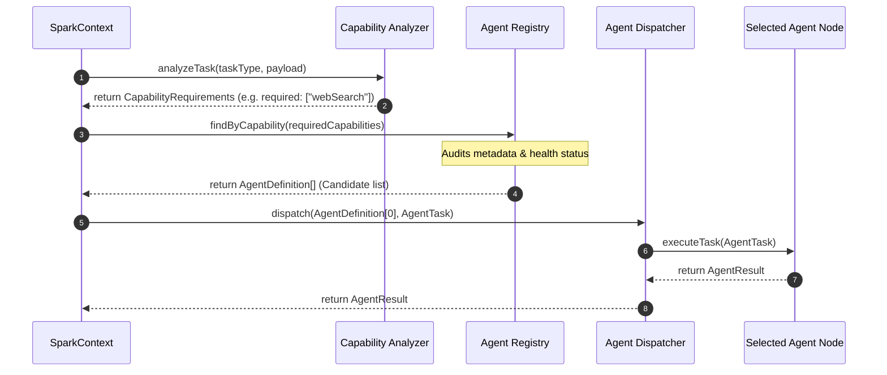

# SPARK Agent Discovery Flow

This document details the step-by-step transaction flow for discovering, validating, and executing a pipeline step using dynamic discovery in the SPARK Media Operating System.

---

## 1. Sequence Flow Diagram

---

## 2. Walkthrough Steps

1. **Task Ingestion**: The `SparkContext` initializes a task execution (e.g. `trend_discovery`).
2. **Capability Assessment**: The `CapabilityAnalyzer` evaluates task payloads to output a list of required capabilities (e.g., `webSearch` and `structuredOutput`).
3. **Registry Query**: `SparkContext` calls `Registry.findByCapability()` with the required capabilities list. The registry scans active entries and screens out any agents set to `"unavailable"` or `"maintenance"`.
4. **Dispatcher Delegation**: The context hands the top-scoring candidate definition and execution payload over to the `AgentDispatcher`.
5. **Execution**: The dispatcher loads the targeted agent module and fires `executeTask()`, returning the result to the context.
