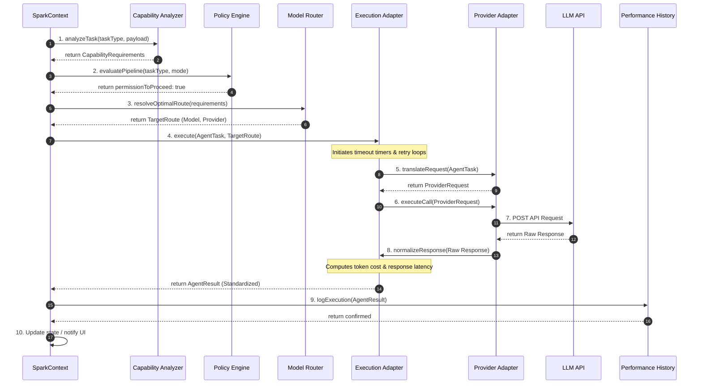

# SPARK Execution Flow Sequence

This document defines the complete lifecycle flow of a task execution inside the SPARK Media Operating System, demonstrating how data propagates from intent to telemetry logs.

---

## 1. Sequence Flow Diagram

