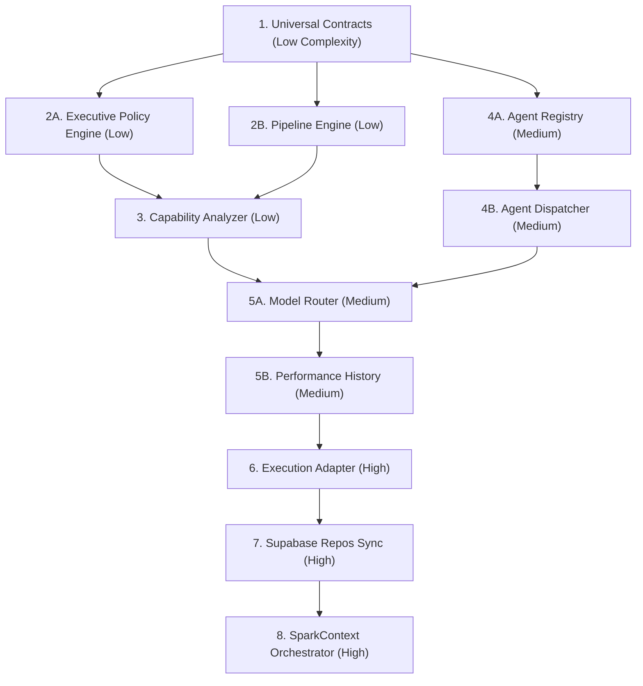

# SPARK Implementation Dependency Graph

This document outlines the execution order, prerequisites, parallelization limits, and complexity weights for the multi-agent operating system runtime implementation.

---

## 1. Subsystem Execution Order

```text
Step 1: Domain Contracts (Universal Contract specs)
  │
  ▼
Step 2: Stateless Engines (Policy Engine + Pipeline Engine) [Parallelizable]
  │
  ├───────────────────────────────┐
  ▼                               ▼
Step 3: Capability Analyzer    Step 4: Agent Registry & Dispatcher
  │                               │
  └───────────────┬───────────────┘
                  ▼
Step 5: Model Router & History Logging
  │
  ▼
Step 6: Execution & Provider Adapters
  │
  ▼
Step 7: Repositories & Supabase Sync
  │
  ▼
Step 8: Orchestrator Integration (SparkContext hooks)
```

---

## 2. Dependency Matrix

| Subsystem Component | Prerequisites | Blocks | Parallelizable? | Must Wait For | Complexity |
| :--- | :--- | :--- | :--- | :--- | :--- |
| **1. Policy Engine** | Domain types | Orchestrator refactoring | Yes | None | Low |
| **2. Pipeline Engine** | Domain types | Orchestrator refactoring | Yes | None | Low |
| **3. Capability Analyzer** | Step schemas | Model Router | Yes | Policy/Pipeline | Low |
| **4. Agent Registry** | Definition schemas | Dispatcher | Yes | None | Medium |
| **5. Model Router** | Performance History | Execution Adapter | No | Capability Analyzer | Medium |
| **6. Execution Adapter** | Provider Adapters | Service Layer | No | Model Router | High |
| **7. Supabase Database Sync** | Migrations | Repositories | Yes | None | High |
| **8. Orchestrator (`SparkContext`)** | Engines, Adapters, Repos | UI Controllers | No | All backend layers | High |

---

## 3. Implementation Flow Diagram (Mermaid)


