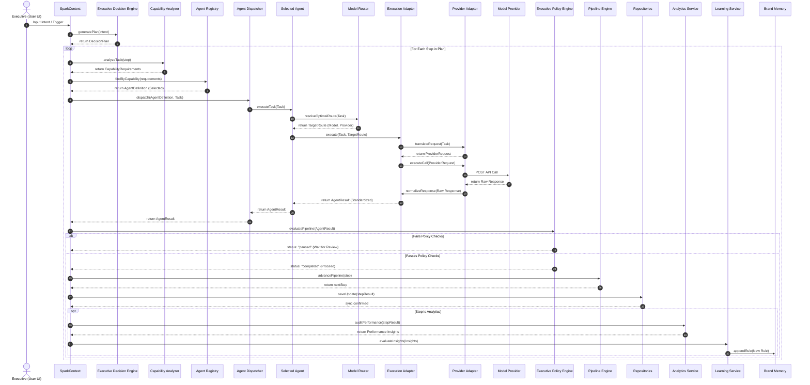

# SPARK Runtime Sequence Diagram

This document defines the complete sequence trace of task execution, demonstrating the interactions between all decoupled subsystems of the SPARK Operating System.

---

## 1. System Sequence Flow

