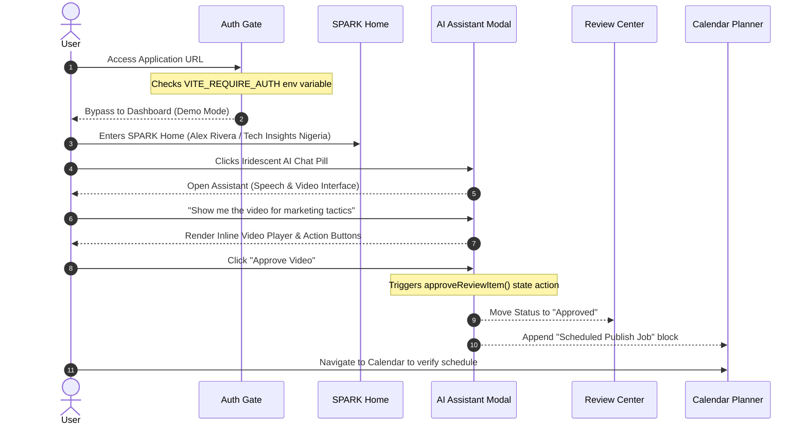
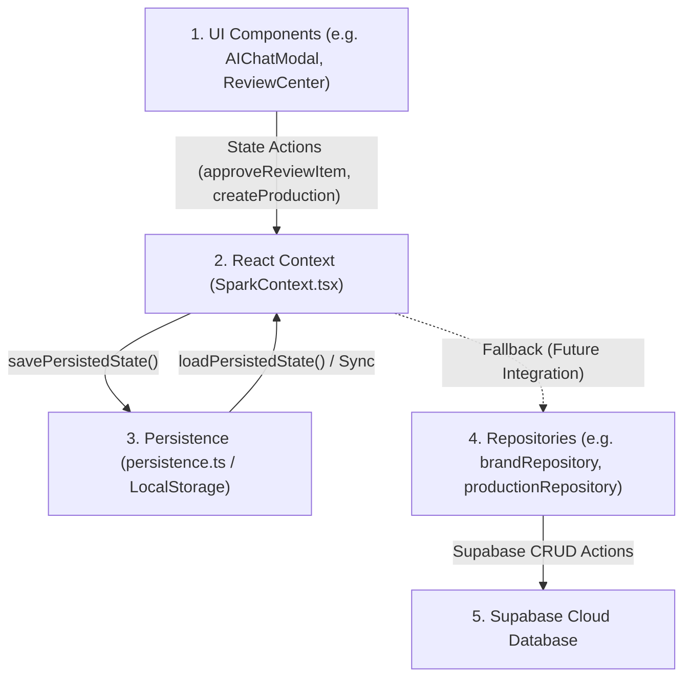

# SPARK System Understanding

This document outlines the operational mechanics, data flow pathways, AI orchestration patterns, and architecture of the SPARK Media Operating System. It is designed to get a new engineer fully up to speed on the system's design and implementation boundaries.

---

## 1. Complete User Flow Walkthrough

The following trace details the step-by-step experience of a new user operating SPARK under the current codebase configuration:

### Step 1: Onboarding
* **What happens**: When a new user navigates to the deployment URL, the application checks whether to enforce authentication.
* **Code Implementation**: By default, `VITE_REQUIRE_AUTH` is not set or false. The `AuthGate.tsx` component returns the dashboard children directly, skipping sign-in.
* **Fallback Behavior**: The app automatically logs the user into a mock administrator account (`Alex Rivera`, `Director`) and sets the active workspace context to `"Tech Insights Nigeria"`.

### Step 2: Authentication
* **What happens**: If `VITE_REQUIRE_AUTH` is set to `"true"`, the user is presented with the `AuthPanel.tsx` credentials form.
* **Code Implementation**: 
  - If `VITE_USE_SUPABASE` is false or unconfigured, input fields are disabled with a warning.
  - If `VITE_USE_SUPABASE` is true, the login form queries the Supabase client wrapper `authService.ts` via `signInWithEmail`/`signUpWithEmail`.

### Step 3: Home Dashboard (SPARK)
* **What happens**: Entering the app mounts `SparkHome.tsx`. The screen displays performance snapshots, active drafting pipelines, connected account integrations (YouTube, TikTok, Instagram, LinkedIn), and AI signal cards.
* **Code Implementation**: Layout state is retrieved from the `SparkContext.tsx` provider, which loads initial values from LocalStorage or seeds defaults from `mockData.ts`.

### Step 4: AI Workspace (MY SPARK)
* **What happens**: The user navigates to the full-screen conversational page `MySpark.tsx`. They type requests or select pre-generated action pills (e.g. *"Analyze my TikTok"*).
* **Code Implementation**: Message panels run a simulated reply generator that outputs pre-formatted Markdown blocks.

### Step 5: Discover (VIRAL SPARKS)
* **What happens**: Users inspect trending opportunities in `ViralSparks.tsx` using platform, niche, and country filters.
* **Code Implementation**: Card grids are rendered from static templates (`defaultViralSparks` list). Clicking "Create Production" initializes a pipeline draft.

### Step 6: Production & Review
* **What happens**: Initiated productions go to the drafting queue. Users click drafts inside `ReviewCenter.tsx` to read script lines, check safety metrics (e.g. brand checks), and watch videos.
* **Code Implementation**:
  - The script and concepts are programmatic JSON objects.
  - The video preview element loads short, mock MP4 files from public Mixkit paths.
  - Clicking **Approve** mutates the item state to `"Approved"`, creating an export bundle and scheduling a calendar post. Clicking **Needs Edit** flags the script.

### Step 7: Calendar & Publishing
* **What happens**: Approved content is plotted onto the grid in `Calendar.tsx`.
* **Code Implementation**: The scheduled publications list is state-driven. No actual external APIs (like Google API or TikTok Graph API) are connected; publishing transitions are simulated.

### Step 8: Analytics
* **What happens**: The user checks `Analytics.tsx` to inspect views, retention graphs, and winning format recommendations.
* **Code Implementation**: Renders custom SVG chart components fed from local static datasets.

### Step 9: Learning (AI Memory)
* **What happens**: Inside the Settings menu, users add or delete strategic brand rules.
* **Code Implementation**: Adding a guideline saves it to the `memoryItems` list in LocalStorage.

---

## 2. Complete AI Flow Trace

The table below maps the implementation level of every AI lifecycle stage in SPARK today:

| AI Stage | Real? | Mocked? | Simulated? | Backend? | Frontend? | Connected? | Implementation Details |
| :--- | :--- | :--- | :--- | :--- | :--- | :--- | :--- |
| **Memory** | Yes | Yes | Yes | No | Yes | Yes | Saved in LocalStorage context; chatbot displays them in text output but does not run real-time vector embeddings (RAG) |
| **Discover** | No | Yes | Yes | No | Yes | No | Trending scores and niche lists are hardcoded arrays |
| **Trend Analysis** | No | Yes | Yes | No | Yes | No | Outputs pre-formatted markdown trend analysis summaries |
| **Brand Reasoning** | No | Yes | Yes | No | Yes | No | Prompt actions fetch predefined script replies |
| **Production Generation** | Yes | No | Yes | No | Yes | Yes | Programmatically builds detailed storyboard script blocks and structures them into context collections |
| **Review** | Yes | Yes | Yes | No | Yes | Yes | Renders script outlines and quality badges; video plays mock URL files |
| **Publishing** | No | Yes | Yes | No | Yes | Yes | Triggers a simulated scheduled post block on the calendar |
| **Analytics** | No | Yes | Yes | No | Yes | No | AI recommendation rules and retention lists are static items |
| **Learning** | Yes | Yes | Yes | No | Yes | Yes | UI updates memory rules dynamically; changes do not alter generation behavior since LLM routing is simulated |

---

## 3. Complete Data Flow Architecture

The data pathways in SPARK are structured as follows:

* **UI Layer**: User interactions in views (desktop components, mobile components, or the AI Chat Modal) call state mutations from `useSpark()`.
* **Context Layer (`SparkContext.tsx`)**: Manages the reactive application state. Upon updating, it triggers a `useEffect` synchronization hook.
* **Persistence Layer (`persistence.ts`)**: Serializes the updated context state into a JSON string and saves it under the `"spark_state"` key in the browser's `LocalStorage`.
* **Repository & Database Layer (Conditional)**:
  - When `VITE_USE_SUPABASE === "true"` is active, authentication profiles are synced via `profileRepository.ts` and brand setups are stored via `brandRepository.ts`.
  - When `VITE_USE_SUPABASE === "false"` (default offline state), the repository calls bypass network calls entirely and yield `unconfiguredResult()` objects, reverting all operations to client-side LocalStorage.
* **Notification Layer (`notificationService.ts`)**: Operates on a static observer pattern. Updates to notifications (read, deleted, or added) bypass the main Context and write to a dedicated `"spark_notifications_store"` LocalStorage item.

---

## 4. Agent Readiness Analysis

We evaluate the current implementation of SPARK to determine its software category:

### Classification: AI-Assisted Application / Agent-Ready Platform Hybrid

Every conclusion is supported by repository evidence:

1. **AI-Assisted Application (Evidence from codebase)**:
   - *Conversational Chatrooms*: `MySpark.tsx` embeds prompt selectors that display text outputs without backend agent interactions.
   - *Static Intelligence Badges*: `Analytics.tsx` and `ViralSparks.tsx` display simulated recommendations and fit percentages.
2. **Agent-Ready Platform (Evidence from codebase)**:
   - *State-Wired AI Modal (`AIChatModal.tsx`)*: The copilot chat modal imports the actual context mutators `approveReviewItem` and `createProductionFromSpark` (from `SparkContext.tsx`).
   - *Action Execution on User Behalf*: Natural language prompts (like *"approve marketing video"* or *"initialize production storyboard"*) trigger programmatic state mutations that update dashboard grids immediately.
   - *Interactive Inline Action Media*: The chat bubble embeds full preview card controllers (Approve, Edit, and Regenerate buttons) directly driving state transitions.
3. **Why it is NOT a Native Multi-Agent System (Evidence from codebase)**:
   - All agent behaviors are simulated locally inside the client's React codebase. There are no backend coordinator agents, message queue protocols, or remote tool-calling execution environments.

### Summary Verdict
SPARK today is a **highly mature Agent-Ready Platform mockup**. The frontend and state context layers are structured to support fully autonomous system agents. The interface and user experience are wowed, fluid, and ready for integration with active LLM engines and backend database layers in the next development phase.
