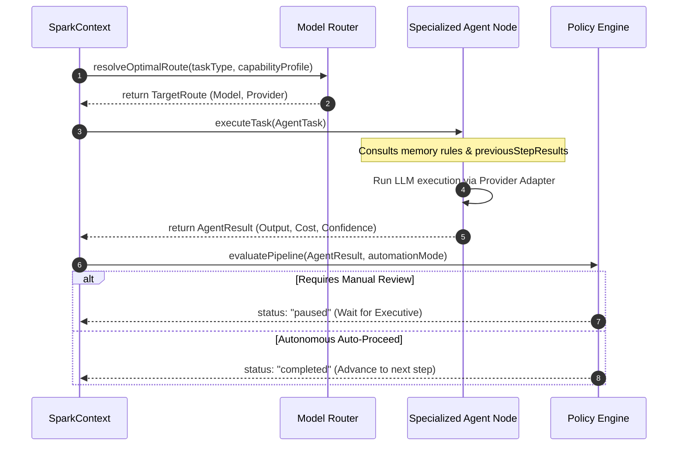

# SPARK Universal Agent Contract

This document defines the provider-agnostic data contracts exchanged throughout SPARK's multi-agent orchestration layer. Every specialized AI agent (Research, Creative, Production, Review, Publishing, Analytics, Learning) must ingest and return these contract structures.

---

## 1. Unified Domain Contracts

```typescript
export type StepType = 
  | "research" 
  | "creative" 
  | "production" 
  | "review" 
  | "publishing" 
  | "analytics" 
  | "learning";

export type AgentStatus = "pending" | "executing" | "completed" | "failed" | "paused";

/**
 * 1. CapabilityProfile Contract
 * Outlines the model requirements for a specific task.
 */
export interface CapabilityProfile {
  requiredCapabilities: string[]; // e.g. ["webSearch", "structuredOutput"]
  preferredCapabilities: string[];// e.g. ["reasoning", "longContext"]
  minimumContextTokens: number;
}

/**
 * 2. ExecutionPolicy Contract
 * Defines execution boundaries, timeouts, and approval checkpoints.
 */
export interface ExecutionPolicy {
  automationMode: "manual" | "balanced" | "autonomous";
  requiresApproval: boolean;
  maxCostLimitUsd: number;
  timeoutMs: number;
  retryLimit: number;
}

/**
 * 3. ExecutionMetrics Contract
 * Captures token counts, processing times, and costs after execution.
 */
export interface ExecutionMetrics {
  inputTokens: number;
  outputTokens: number;
  monetaryCostUsd: number;
  latencyMs: number;
}

/**
 * 4. ExecutionContext Contract
 * Provides the context and memory logs required to perform the task.
 */
export interface ExecutionContext {
  brandId: string;
  niche: string;
  toneGuidelines: string[];
  memoryRulesApplied: { id: string; rule: string }[];
  connectedPlatforms: string[];
  previousStepResults: Record<string, any>; // Cascaded outputs from past steps
}

/**
 * 5. AgentTask Contract
 * The core unit of work sent to an agent.
 */
export interface AgentTask {
  taskId: string;
  pipelineId: string;
  taskType: StepType;
  inputPayload: any;              // JSON payload (e.g. hook tags, raw text)
  context: ExecutionContext;
  capabilities: CapabilityProfile;
  policy: ExecutionPolicy;
}

/**
 * 6. AgentResult Contract
 * The outcome returned by an agent upon completing execution.
 */
export interface AgentResult {
  taskId: string;
  pipelineId: string;
  status: AgentStatus;
  outputPayload: any;             // Structured JSON results (e.g. script draft)
  confidenceScore: number;        // Scale of 0-100
  metrics: ExecutionMetrics;
  appliedModel: {
    modelId: string;
    provider: string;
  };
  errors?: string[];
  warnings?: string[];
}
```

---

## 2. Sequence Handover Flow

The lifecycle of an `AgentTask` is coordinated by `SparkContext` as follows:



---

## 3. Implementation Guidelines for Future Agents

When writing a new agent node:
1. **Never write SDK imports directly inside the agent**: All provider queries must pass through the `ILlmProvider` wrapper.
2. **Strictly type input and outputs**: The agent wrapper must parse the inbound `AgentTask` to extract the `inputPayload` and `ExecutionContext`, and format its return as an `AgentResult`.
3. **Record metrics**: Ingest execution latency and token metrics, forwarding them inside the `ExecutionMetrics` schema.
