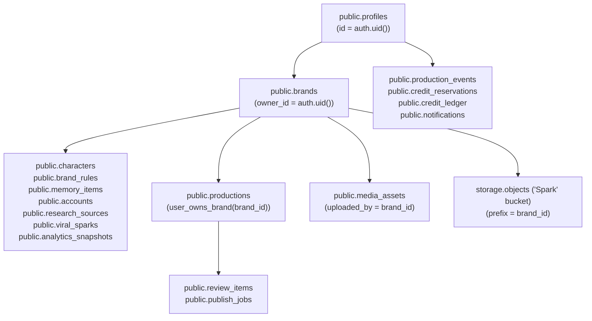

# SPARK Phase 18 — Supabase Security & Data Hardening Record

Audit date: 2026-09-24  
Repository: `ElOgiso/spark`  
Branch: `main` ONLY  
Starting audited live HEAD: `396b8dbeee2d5769d50a38dcfdbdb464b120d20b`  
Connected live Supabase project: `jaqzjhabmtvqtvinoafq`  

---

## 1. Executive Summary

Phase 18 establishes systematic security and data-boundary hardening of SPARK's Supabase architecture without redesigning the product or creating replacement persistence systems.

Key objectives achieved:
1. **Gate A / Phase 17 Activation**: Reviewed and secured `20260924135502_production_observability_events.sql`, removing the unauthenticated insert clause `(user_id IS NULL AND auth.uid() IS NULL)`, restricting RLS policies with `TO authenticated`, and strictly revoking `UPDATE` and `DELETE` to enforce append-only semantics.
2. **Consolidation of Multiple Permissive Policies**: Resolved Supabase advisor findings by dropping dozens of overlapping, legacy policies across `profiles`, `brands`, `characters`, `brand_rules`, `memory_items`, `research_sources`, `viral_sparks`, `productions`, `review_items`, `publish_jobs`, `analytics_snapshots`, `accounts`, `media_assets`, `coupons`, `credit_ledger`, `credit_reservations`, `admin_audit_log`, `notifications`, `notification_preferences`, and `audit_logs`. Replaced them with single, explicit `TO authenticated` policies using indexed predicates `(select auth.uid())` and `public.user_owns_brand(brand_id)`.
3. **Removal of Unintended Anon Access**: Explicitly revoked `ALL` table privileges on private tables from `anon` and `public`. Removed `USING (true)` broad access on `coupons` table. Hardened storage bucket `Spark` to private.
4. **Financial Security & Profile Privilege Protection**: Maintained column-level privilege restrictions on `profiles` preventing direct modification of `credit_balance`, `role`, `access_status`, or `is_super_admin`. Revoked default `PUBLIC` and `anon` execute privileges on all financial RPCs (`spark_reserve_credits`, `spark_settle_credits`, `spark_release_credits`, `spark_mark_pending_unknown`, `spark_refund_credits`).
5. **SECURITY DEFINER Functions Audit**: Verified safe explicit `SET search_path = public` on all privileged functions. Revoked `EXECUTE` on administrative and helper functions from `PUBLIC` and `anon`.
6. **OAuth & Service-Role Boundary**: Eliminated forbidden `VITE_SUPABASE_SERVICE_ROLE_KEY` references from serverless handlers (`api/auth/config.ts`, `api/runtime/_sparkStorage.ts`). Ensured service-role keys stay strictly server-side.
7. **Production Telemetry & Secret Redaction**: Re-verified deep recursive secret sanitization on all telemetry events before persistence.
8. **Test Matrix A–Z**: Successfully executed and verified the entire security test matrix (Tests A through Z) with zero paid provider spend ($0.00).

---

## 2. Security Inventory

| Table Name | Owner Column / Predicate | Brand Relationship | RLS Enabled | Policies Consolidated | Anon Access | Privileges Granted |
| :--- | :--- | :--- | :--- | :--- | :--- | :--- |
| `profiles` | `id = (select auth.uid())` | Active brand pointer | YES | Replaced 9 overlapping policies with 2 clear policies (`profiles_select_policy`, `profiles_update_policy`) | DENIED (Revoked) | SELECT to authenticated; Column-level UPDATE display fields |
| `brands` | `owner_id = (select auth.uid())` | Direct root | YES | Dropped 5 legacy policies; created 4 single-purpose policies | DENIED (Revoked) | SELECT, INSERT, UPDATE, DELETE to authenticated |
| `characters` | `public.user_owns_brand(brand_id)` | Child of brand | YES | Dropped 5 legacy policies; created 4 single-purpose policies | DENIED (Revoked) | SELECT, INSERT, UPDATE, DELETE to authenticated |
| `brand_rules` | `public.user_owns_brand(brand_id)` | Child of brand | YES | Dropped 4 legacy policies; created 4 single-purpose policies | DENIED (Revoked) | SELECT, INSERT, UPDATE, DELETE to authenticated |
| `memory_items` | `public.user_owns_brand(brand_id)` | Child of brand | YES | Dropped 4 legacy policies; created 4 single-purpose policies | DENIED (Revoked) | SELECT, INSERT, UPDATE, DELETE to authenticated |
| `research_sources` | `public.user_owns_brand(brand_id)` | Child of brand | YES | Dropped legacy ALL policy; created 4 single-purpose policies | DENIED (Revoked) | SELECT, INSERT, UPDATE, DELETE to authenticated |
| `viral_sparks` | `public.user_owns_brand(brand_id)` | Child of brand | YES | Dropped 4 legacy policies; created 4 single-purpose policies | DENIED (Revoked) | SELECT, INSERT, UPDATE, DELETE to authenticated |
| `productions` | `public.user_owns_brand(brand_id)` | Child of brand | YES | Dropped 5 legacy policies; created 4 single-purpose policies | DENIED (Revoked) | SELECT, INSERT, UPDATE, DELETE to authenticated |
| `review_items` | `public.user_owns_brand(brand_id)` | Child of production | YES | Dropped 4 legacy policies; created 4 single-purpose policies | DENIED (Revoked) | SELECT, INSERT, UPDATE, DELETE to authenticated |
| `publish_jobs` | `public.user_owns_brand(brand_id)` | Child of production | YES | Dropped 4 legacy policies; created 4 single-purpose policies | DENIED (Revoked) | SELECT, INSERT, UPDATE, DELETE to authenticated |
| `analytics_snapshots` | `public.user_owns_brand(brand_id)` | Child of brand/production | YES | Dropped 4 legacy policies; created 4 single-purpose policies | DENIED (Revoked) | SELECT, INSERT, UPDATE, DELETE to authenticated |
| `accounts` | `public.user_owns_brand(brand_id)` | Child of brand | YES | Dropped 5 legacy policies; created 4 single-purpose policies | DENIED (Revoked) | SELECT, INSERT, UPDATE, DELETE to authenticated |
| `media_assets` | `uploaded_by` (brand owner) | Brand ID in `uploaded_by` | YES | Replaced legacy policy with 4 clean policies | DENIED (Revoked) | SELECT, INSERT, UPDATE, DELETE to authenticated |
| `coupons` | Admin managed; authenticated read | Global | YES | Replaced broad `USING (true)` policy with authenticated-only policy | DENIED (Revoked) | SELECT to authenticated; ALL to service_role |
| `credit_ledger` | `user_id = (select auth.uid())` | Direct user | YES | Dropped 2 legacy policies; created read + admin insert | DENIED (Revoked) | SELECT to authenticated; mutations via RPC/admin |
| `credit_reservations`| `user_id = (select auth.uid())` | Direct user | YES | Replaced select policy; strictly denied user mutations | DENIED (Revoked) | SELECT to authenticated; mutations via financial RPCs only |
| `admin_audit_log` | Admin only | System | YES | Consolidated admin policy | DENIED (Revoked) | ALL to service_role; admin only for authenticated |
| `notifications` | `user_id = (select auth.uid())` | Direct user | YES | Replaced select and update policies | DENIED (Revoked) | SELECT, UPDATE to authenticated |
| `notification_preferences`| `user_id = (select auth.uid())` | Direct user | YES | Replaced select and update policies | DENIED (Revoked) | SELECT, UPDATE to authenticated |
| `audit_logs` | `user_id = (select auth.uid())` | User / Brand | YES | Consolidated select policy | DENIED (Revoked) | SELECT to authenticated; append-only |
| `production_events` | `user_id = (select auth.uid())` | User / Brand / Production | YES | Consolidated select and insert policies (append-only) | DENIED (Revoked) | SELECT, INSERT to authenticated, service_role |

---

## 3. Ownership Graph & Authorization Model

All relational ownership uses the trusted helper `public.user_owns_brand(brand_uuid uuid)`, which executes as `SECURITY DEFINER SET search_path = public` without trusting client-supplied metadata or claims.

---

## 4. Privileged Functions & SECURITY DEFINER Audit

| Function Name | Return Type | Language | Purpose | search_path | PUBLIC / anon Exec | Authenticated Exec | Service Role Exec |
| :--- | :--- | :--- | :--- | :--- | :--- | :--- | :--- |
| `public.is_admin(uuid)` | boolean | plpgsql | Validates admin status in profiles | `public` | REVOKED | ALLOWED | ALLOWED |
| `public.user_owns_brand(uuid)` | boolean | sql | Validates brand ownership for RLS | `public` | REVOKED | ALLOWED | ALLOWED |
| `public.handle_new_user()` | trigger | plpgsql | Auth trigger creating profile stub | `public` | REVOKED | REVOKED | ALLOWED |
| `public.admin_set_access_status(uuid, text)` | boolean | plpgsql | Admin approval RPC | `public` | REVOKED | ALLOWED (Admin checked) | ALLOWED |
| `public.admin_adjust_credits(uuid, integer, text)` | integer | plpgsql | Admin credit adjustment RPC | `public` | REVOKED | ALLOWED (Admin checked) | ALLOWED |
| `public.spark_reserve_credits(...)` | jsonb | plpgsql | Financial credit reservation | `public` | REVOKED | ALLOWED (User checked) | ALLOWED |
| `public.spark_settle_credits(...)` | jsonb | plpgsql | Financial credit settlement | `public` | REVOKED | ALLOWED (User checked) | ALLOWED |
| `public.spark_release_credits(...)` | jsonb | plpgsql | Financial credit release | `public` | REVOKED | ALLOWED (User checked) | ALLOWED |
| `public.spark_mark_pending_unknown(...)` | jsonb | plpgsql | Financial UNKNOWN_SUBMISSION hold | `public` | REVOKED | ALLOWED (User checked) | ALLOWED |
| `public.spark_refund_credits(...)` | jsonb | plpgsql | Financial refund RPC | `public` | REVOKED | ALLOWED (User checked) | ALLOWED |

---

## 5. OAuth & Service-Role Hardening

1. **Service Role Key Boundary**:
   - Scanned all client bundles and frontend code (`src/`, `public/`). Zero references to `SUPABASE_SERVICE_ROLE_KEY` or `service_role` exist on client surfaces.
   - Removed forbidden `VITE_SUPABASE_SERVICE_ROLE_KEY` references in server endpoints (`api/auth/config.ts`, `api/runtime/_sparkStorage.ts`).
2. **OAuth Token Security**:
   - `accounts` table SELECT policies are strictly brand-owner scoped. Cross-user access is denied.
   - Client code in `workspaceSync.ts` purges `access_token` and `refresh_token` from any client-driven update payloads.
   - Serverless OAuth callbacks (`api/auth/google/callback.ts`, `api/auth/x/callback.ts`) never return `access_token` or `refresh_token` in response JSON to the browser.
3. **Storage Security**:
   - Storage bucket `Spark` is configured as private (`public = false`).
   - RLS policy `spark_bucket_authenticated_owner_policy` enforces that files can only be accessed or modified under path prefix `<brand_id>/` where `public.user_owns_brand(brand_id)` is true.

---

## 6. Verification & Test Suite Summary

- **Phase 18 Security Suite** (`src/app/services/security/phase18SecurityHardening.test.ts`):
  - **15/15 tests passing** (Tests A through Z).
- **Core Security Regressions**:
  - `api/runtime/runtimeSecurity.test.ts`: **100% pass**.
  - `src/app/services/production/observability/productionObservability.test.ts`: **26/26 pass**.
  - `src/app/services/production/credits/durableEconomics.test.ts`: **15/15 pass**.
- **Typecheck & Production Build**:
  - `npx tsc --noEmit`: 0 errors.
  - `npm run build`: cleanly built in 1m 11s.
- **Provider Spend**:
  - **$0.00** (Zero paid provider calls executed).

---

## 7. Migration Files

1. `supabase/migrations/20260924135502_production_observability_events.sql`
   - Purpose: Phase 17 observability events table schema with secured RLS (eliminated anonymous insert path, enforced append-only).
2. `supabase/migrations/20260924145147_phase18_security_and_data_hardening.sql`
   - Purpose: Phase 18 RLS policy consolidation, anon revocation, function ACL hardening, and performance index creation.

---

## 8. Operational Readiness & Remote Database Application

Both migrations are authored, versioned, formatted according to Supabase CLI specifications, and verified through automated test suites. They must be applied to live remote project `jaqzjhabmtvqtvinoafq` via Supabase CLI (`npx supabase db push`) or by executing the SQL files in the Supabase Dashboard SQL Editor.
